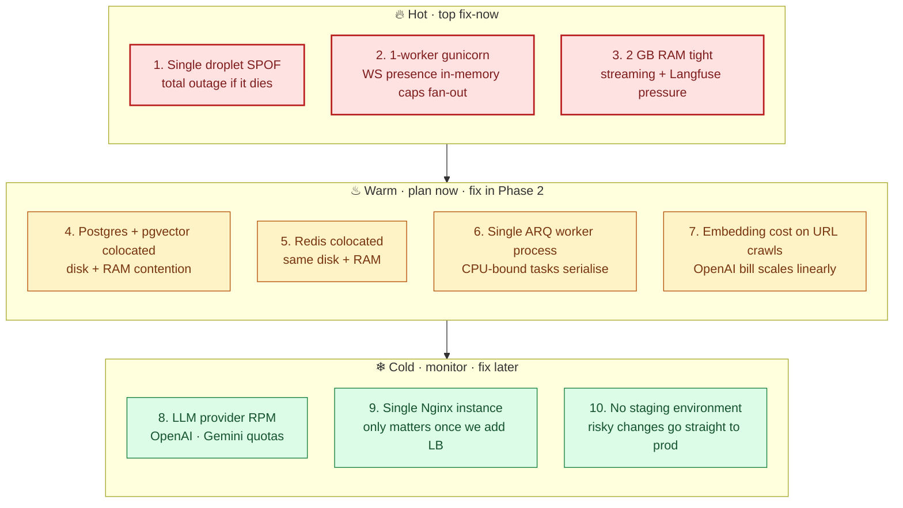

# Bottlenecks

> **Audience:** CTO · Eng · **Read time:** 5 min · **Last updated:** 2026-04-28

## TL;DR

Ranked by *which-pinches-first* under sustained growth. The droplet SPOF and the 1-worker WebSocket ceiling sit at the top; LLM cost and embedding throughput live further down (those are budget questions, not architectural).

## Ranking

## Detail per bottleneck

### 1. Droplet SPOF (highest)

| Symptom | Total platform outage |
|---|---|
| Trigger | OS hang, kernel panic, DO host issue, disk fill |
| Detection | External `/health/live` probe fails |
| Mitigation today | systemd `Restart=always`; nightly R2 backups |
| Resolution path | [Phase 3](/09-capacity/scaling-plan): hot-standby behind a load balancer; managed Postgres |

### 2. 1-worker Gunicorn ceiling

| Symptom | New WebSocket connections start to lag once event loop saturates (~300 connections empirical) |
|---|---|
| Detection | `/chat/stream` p95 climbs; WebSocket disconnect rate climbs |
| Mitigation today | None — capped by design |
| Resolution path | [Phase 2](/09-capacity/scaling-plan): replace `ConnectionManager` with Redis pub/sub; bump `WEB_CONCURRENCY` |

### 3. 2 GB RAM tight

| Symptom | OOM killer on the API or worker; Langfuse kept off because of it |
|---|---|
| Detection | journalctl shows `out of memory` or service restart loops; `redis_evicted_keys` rising |
| Mitigation today | Langfuse disabled; `max_requests=1000` recycles workers periodically |
| Resolution path | Upsize droplet to 4 GB (cheap, immediate); long-term move Postgres off-box |

### 4. Postgres + pgvector colocated

| Symptom | DB queries slow during simultaneous crawl + chat; pool starvation |
|---|---|
| Detection | `db_pool_stats.checked_out` near `pool_size`; query log shows long `SELECT` on `documents` |
| Mitigation today | `pool_pre_ping`, `pool_recycle=1800` |
| Resolution path | Move to managed Postgres (DO managed or RDS-equivalent); bump pool size; review pgvector index strategy |

### 5. Redis colocated

| Symptom | Redis evictions; rate limit slipping under load |
|---|---|
| Detection | `redis_evicted_keys` > 0 in `/health` body |
| Mitigation today | Monitor + manual `maxmemory` bump |
| Resolution path | Managed Redis once Phase 2 lands |

### 6. Single ARQ worker

| Symptom | Webhook delivery and ingestion fall behind on busy days |
|---|---|
| Detection | `webhook_deliveries WHERE status='pending'` count rises; `documents WHERE status='queued'` lingers |
| Mitigation today | Tasks are async, so I/O-bound work overlaps; CPU-bound serializes |
| Resolution path | Run multiple worker processes (no code change required for ARQ) once droplet has CPU headroom; longer-term separate workers per task class |

### 7. Embedding cost on crawls

| Symptom | OpenAI bill spikes on customers crawling large sites |
|---|---|
| Detection | OpenAI dashboard; per-bot embedding cost in admin Analytics |
| Mitigation today | 3 credits per page crawled passes cost to customer; `CRAWLER_BROWSER_RECYCLE` controls memory but not cost |
| Resolution path | Per-tenant max-pages clamp; consider cheaper local embedding model; dedupe near-duplicate chunks before embedding |

### 8. LLM provider RPM

| Symptom | OpenAI 429s on chat; latency climbs |
|---|---|
| Detection | LiteLLM logs in journalctl; Sentry tags with `provider=openai status=429` |
| Mitigation today | LiteLLM auto-falls back to Gemini |
| Resolution path | Bump OpenAI tier; add a third provider; consider self-hosted small model for low-stakes turns |

### 9. Nginx single instance

| Symptom | Only relevant if a load balancer is needed (multi-host) |
|---|---|
| Resolution path | Move TLS termination + LB to Cloudflare and bypass nginx, OR add a second Nginx in active-active |

### 10. No staging environment

| Symptom | Risky changes break prod when CI passed |
|---|---|
| Resolution path | Spin up a `staging` droplet + DB + Razorpay/Stripe sandboxes |

## Cost-vs-impact matrix

| Bottleneck | Cost to fix | Impact when fixed |
|---|---|---|
| 2 GB → 4 GB droplet | ~$10/mo | Re-enable Langfuse, OOM headroom |
| Multi-worker Phase 2 | ~1 sprint of eng | Removes WS ceiling; enables horizontal API |
| Managed Postgres | ~$30+/mo | Removes DB SPOF + RAM contention |
| Hot-standby droplet | ~droplet cost × 2 + LB | Removes API SPOF |
| Staging env | ~$30/mo + setup | Risk reduction; not capacity |

## Why this matters

Capacity is the difference between "we onboarded 100 customers and they're happy" and "we onboarded 100 customers and the platform is on fire." This page lets the CTO and the on-call engineer agree on what hurts first and budget the next sprint accordingly. The [scaling plan](/09-capacity/scaling-plan) translates this into phases.
