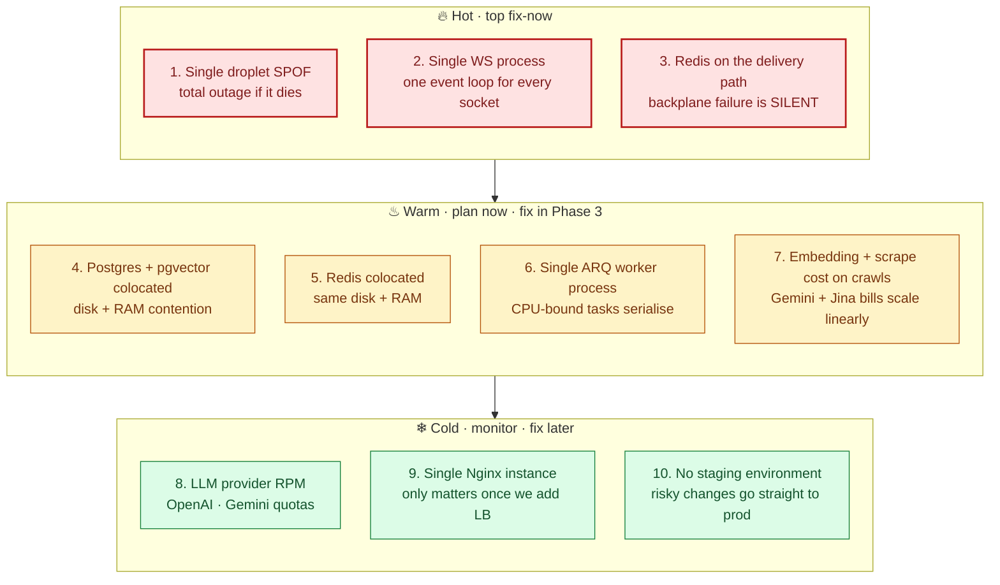

# Bottlenecks

> **Audience:** CTO · Eng · **Read time:** 5 min · **Last updated:** 2026-08-31

## TL;DR

Ranked by *which-pinches-first* under sustained growth. The droplet SPOF is now alone at the top: the 1-worker WebSocket ceiling that used to sit beside it was resolved on 2026-08-20 by splitting `/ws/*` into its own process behind a Redis backplane, which let the API go to two workers. LLM cost and embedding throughput live further down (those are budget questions, not architectural).

## Ranking

```mermaid
---
config:
  flowchart:
    nodeSpacing: 35
    rankSpacing: 50
---
flowchart TB
    classDef hot fill:#fee2e2,stroke:#b91c1c,color:#7f1d1d,stroke-width:2px
    classDef warm fill:#fef3c7,stroke:#b45309,color:#78350f
    classDef cold fill:#dcfce7,stroke:#15803d,color:#14532d

    subgraph Hot["🔥 Hot · top fix-now"]
      direction TB
      A["1. Single droplet SPOF<br/>total outage if it dies"]:::hot
      B["2. Single WS process<br/>one event loop for every socket"]:::hot
      C["3. Redis on the delivery path<br/>backplane failure is SILENT"]:::hot
    end

    subgraph Warm["♨ Warm · plan now · fix in Phase 3"]
      direction TB
      D["4. Postgres + pgvector colocated<br/>disk + RAM contention"]:::warm
      E["5. Redis colocated<br/>same disk + RAM"]:::warm
      F["6. Single ARQ worker process<br/>CPU-bound tasks serialise"]:::warm
      G["7. Embedding + scrape cost on crawls<br/>Gemini + Jina bills scale linearly"]:::warm
    end

    subgraph Cold["❄ Cold · monitor · fix later"]
      direction TB
      H["8. LLM provider RPM<br/>OpenAI · Gemini quotas"]:::cold
      I["9. Single Nginx instance<br/>only matters once we add LB"]:::cold
      J["10. No staging environment<br/>risky changes go straight to prod"]:::cold
    end

    Hot --> Warm --> Cold
```

## Detail per bottleneck

### 1. Droplet SPOF (highest)

| Symptom | Total platform outage |
|---|---|
| Trigger | OS hang, kernel panic, DO host issue, disk fill |
| Detection | External `/health/live` probe fails |
| Mitigation today | systemd `Restart=always`; nightly R2 backups |
| Resolution path | [Phase 3](/09-capacity/scaling-plan): hot-standby behind a load balancer; managed Postgres |

### 2. Single WebSocket process

| Symptom | New WebSocket connections lag once the one event loop saturates (~300 connections, empirical) |
|---|---|
| Detection | WebSocket disconnect rate climbs; operator "typing" and read receipts go sluggish |
| Mitigation today | Outgoing translation is dispatched into per-session tasks rather than awaited inside the receive loop, so one slow translation no longer stalls that operator's other conversations for up to 4s |
| Resolution path | The backplane already makes N WS processes possible in principle; the work is presence-key ownership and sticky routing, not the fan-out |

### 3. Redis is now on the live-chat delivery path

| Symptom | Handoffs raised on the API process never reach an operator. The operator sees "Waiting (0)" beside a sidebar badge of 1 |
|---|---|
| Why it is nasty | Backplane publishes are **best-effort and fail open by design** (a Redis outage must never turn a visitor's message into a 500), so the failure is silent. `WS_BACKPLANE_ENABLED` now defaults **true** in `config.py` and the deploy writes `${WS_BACKPLANE_ENABLED:-true}`, so the API and WS processes agree by default; the flag is still inert without `REDIS_URL`, and an explicit repo variable of false reintroduces the split |
| Detection | Compare the queue badge against `GET /operators/queue`; check Redis reachability from both processes; confirm the repo variable is actually set |
| Mitigation today | `cancel_handoff`, `request_handoff`, accept, transfer, the operator roster and `broadcast_qualified_bot_changed` all union local sockets with Redis presence rather than iterating a per-process dict |
| Resolution path | Alarm on the flag's effective value per process, not just on Redis liveness |

### 4. Postgres + pgvector colocated

| Symptom | DB queries slow during simultaneous crawl + chat; pool starvation |
|---|---|
| Detection | `db_pool_stats.checked_out` near `pool_size`; query log shows long `SELECT` on `documents`. Watch for the misleading shape: `CHAT_MAX_CONCURRENCY` above the per-worker pool ceiling produces worker kills and 30s+ p95 while Postgres sits **100% idle** |
| Mitigation today | `pool_pre_ping`, `pool_recycle=1800`, and the divided per-worker budget (3+5 × 2 workers) |
| Resolution path | Move to managed Postgres (DO managed or RDS-equivalent); bump pool size; review pgvector index strategy |

### 5. Redis colocated

| Symptom | Redis evictions; rate limit slipping under load |
|---|---|
| Detection | `redis_evicted_keys` > 0 in `/health` body |
| Mitigation today | Monitor + manual `maxmemory` bump |
| Resolution path | Managed Redis in [Phase 3](/09-capacity/scaling-plan) — now a delivery-path decision, not just a cache one |

### 6. Single ARQ worker

| Symptom | Webhook delivery and ingestion fall behind on busy days |
|---|---|
| Detection | `webhook_deliveries WHERE next_retry_at <= now() AND delivered_at IS NULL` backs up (there is no `status` column); crawl progress in Redis stalls |
| Mitigation today | Tasks are async and the pipeline is now almost entirely network-bound (no local browser, no local embedding model), so work overlaps freely |
| Resolution path | Run multiple worker processes (no code change required for ARQ) once droplet has CPU headroom; longer-term separate workers per task class |

### 7. Embedding + scrape cost on crawls

| Symptom | Gemini and Jina bills spike on customers crawling large sites |
|---|---|
| Detection | Provider dashboards; per-bot ingestion cost in the console's analytics |
| Mitigation today | 5 credits per page crawled passes cost to the customer; the **character** quota (Free 2,500 / Starter 50,000) is the binding cap and aborts the crawl long before the page count would; a per-URL `idempotency_key` stops retries being charged twice |
| Resolution path | Dedupe near-duplicate chunks before embedding; surface the abort reason prominently so a customer on a small plan understands why their 400-page site stopped at ~25 pages |

### 8. LLM provider RPM

| Symptom | OpenAI 429s on chat; latency climbs. Gemini 429s are worse — they hit embeddings and both gates as well as the fallback |
|---|---|
| Detection | LiteLLM logs in journalctl; `EMBED_QUERY_MAX_WAIT_S` abandonments showing up as keyword-only retrieval |
| Mitigation today | LiteLLM auto-falls back to Gemini for chat; the embed client self-throttles to `EMBED_RPM_LIMIT` |
| Resolution path | Bump the Gemini tier and raise `EMBED_RPM_LIMIT` with it; add a third chat provider. **Do not** add a second *embedding* provider — mixing embedding spaces corrupts retrieval |

### 9. Nginx single instance

| Symptom | Only relevant if a load balancer is needed (multi-host) |
|---|---|
| Resolution path | Move TLS termination + LB to Cloudflare and bypass nginx, OR add a second Nginx in active-active |

### 10. No staging environment

| Symptom | Risky changes break prod when CI passed |
|---|---|
| Resolution path | Spin up a `staging` droplet + DB + a Razorpay sandbox |

## Cost-vs-impact matrix

| Bottleneck | Cost to fix | Impact when fixed |
|---|---|---|
| Bigger droplet | ~$10/mo | OOM headroom for three co-resident Python processes |
| ~~Multi-worker Phase 2~~ | **done (2026-08-20)** | WS split + Redis backplane; API now runs 2 workers |
| Multiple WS processes | ~1 sprint of eng | Removes the single-event-loop socket ceiling |
| Managed Postgres | ~$30+/mo | Removes DB SPOF + RAM contention |
| Hot-standby droplet | ~droplet cost × 2 + LB | Removes API SPOF |
| Staging env | ~$30/mo + setup | Risk reduction; not capacity |

## Why this matters

Capacity is the difference between "we onboarded 100 customers and they're happy" and "we onboarded 100 customers and the platform is on fire." This page lets the CTO and the on-call engineer agree on what hurts first and budget the next sprint accordingly. The [scaling plan](/09-capacity/scaling-plan) translates this into phases.
