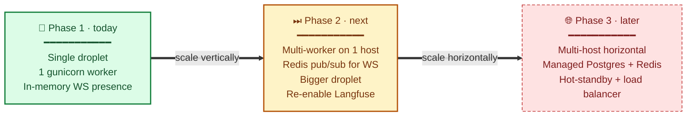

# Scaling plan

> **Audience:** CTO · Eng leads · **Read time:** 5 min · **Last updated:** 2026-04-28

## TL;DR

Three phases. **Phase 1 (today)** — single droplet, single worker, deliberate simplicity. **Phase 2** — Redis pub/sub for WebSocket fan-out so we can run multiple Gunicorn workers and (later) multiple API hosts. **Phase 3** — managed Postgres + Redis, hot-standby API host behind a load balancer, ARQ worker fleet.

## Phase map

## Phase 1 — Today

| Component | State |
|---|---|
| API | 1 Gunicorn worker, single droplet |
| Worker | 1 ARQ process, same droplet |
| Postgres | Self-hosted on droplet |
| Redis | Self-hosted on droplet (since 2026-04-27) |
| Widget | Cloudflare R2 + CDN |
| Admin | Vercel |
| Backups | Nightly `pg_dump` to Cloudflare R2 |

**Why deliberately simple:** small customer base, one team, one place to debug. Buying complexity now means paying interest for years.

## Phase 2 — Multi-worker on one host

**Trigger to start:** any of the following:
- p95 chat latency degrades under load
- WebSocket disconnect rate climbs over a few percent
- OOM kills observed in journalctl

### Work items (rough order)

1. **Upsize droplet to 4 GB RAM**, bumping monthly spend by ~$10. Immediate breathing room; re-enables Langfuse.
2. **Refactor `ConnectionManager`** in `live_chat_service.py` to use **Redis pub/sub** rather than an in-process dict.
   - Each Gunicorn worker subscribes to `oyechats:ws:operator:{client_id}` and `oyechats:ws:visitor:{session_id}`.
   - Outgoing WS messages publish to Redis; the worker holding the destination connection forwards.
   - Local in-memory dict still tracks the connections this worker owns; cross-worker delivery routes through Redis.
   - Keep this change behind a feature flag (`WS_PUBSUB_ENABLED`) so we can roll back fast.
3. **Bump `WEB_CONCURRENCY`** to ≥ 2. Validate WebSocket cross-worker delivery in dev with two locally-bound workers before rolling.
4. **ARQ worker count** — run 2 worker processes on the same droplet so we can keep CPU-bound tasks (Playwright crawls) off the I/O worker's plate.
5. **Sentry budget review** — bump trace sample rate now that we have headroom.

### Estimated effort

~1–2 sprints (1 engineer). The risk is in the WS refactor; everything else is config.

### Phase 2 success metrics

- p95 chat latency stable as load doubles
- 0 cross-worker WS message losses in synthetic test
- Langfuse traces flowing for ≥ 99% of chat turns

## Phase 3 — Multi-host horizontal

**Trigger to start:** when Phase-2 single-droplet utilisation hits 70% on any of CPU / memory / DB connections regularly.

### Work items (rough order)

1. **Move Postgres to a managed instance** (DO Managed Postgres or AWS RDS-equivalent).
   - Run Postgres backups via the managed-service feature, retire `scripts/backup.sh`.
   - Update `DB_URL` and connection pooling (consider PgBouncer if connection count climbs).
2. **Move Redis to a managed instance** (Upstash or DO Managed Redis).
3. **Add a second API droplet (hot standby)** behind a Cloudflare Load Balancer.
   - Both droplets connect to the same managed PG + Redis.
   - Sticky sessions on `ip_hash` (Cloudflare LB equivalent) for WebSocket affinity.
4. **ARQ worker fleet** — separate VM(s) so worker CPU doesn't compete with API.
5. **Staging environment** — second droplet pointed at separate DB + sandbox provider keys.
6. **Origin certificate auth** Cloudflare → API hosts (replaces "trust the Cloudflare network" model).

### Estimated effort

~1 quarter. Bulk of the work is testing — the architecture itself is straightforward.

### Phase 3 success metrics

- Single droplet failure tolerated with < 1 min user-visible blip
- Provisional 99.95% availability on `/health/live` (external probe)
- DR drill: restore from managed PG snapshot in < 30 min

## Costs

Indicative monthly spend per phase (excluding LLM tokens):

| Item | Phase 1 | Phase 2 | Phase 3 |
|---|---|---|---|
| Droplet(s) | $12 (2GB) | $24 (4GB) | $48 (2× 4GB + LB) |
| Managed Postgres | — | — | $30+ |
| Managed Redis | — | — | $15+ |
| Cloudflare R2 + CDN | $0 | $0 | $0 (low egress) |
| R2 storage | < $1 | < $1 | < $1 |
| Sentry / Langfuse | free / $0 | free | $30 |
| Vercel | free | free | free or $20 |
| **Total** | **~$15** | **~$30** | **~$150** |

## Out of scope (for now)

- **Kubernetes / multi-region** — neither customer demand nor scale justifies the complexity yet.
- **Microservices split** — we'd need stronger team boundaries first; today's mono-API is faster to evolve.
- **Per-tenant DB schemas** — only worth it for enterprise compliance; defer until a customer asks.
- **GraphQL or gRPC** — REST + SSE + WS does the job; no caller need.

## Why this matters

Phase planning protects us from two failure modes: **over-engineering** (paying complexity interest before customers need it) and **panic-engineering** (rebuilding under fire when something melts). The triggers above are the bridges between phases. When a metric crosses a threshold, this page is what we re-read; until then, ship features.
