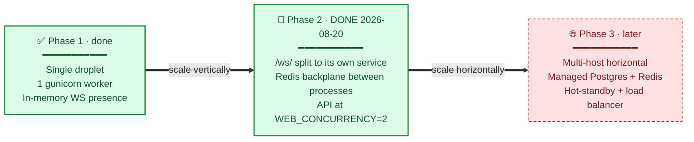

# Scaling plan

> **Audience:** CTO · Eng leads · **Read time:** 5 min · **Last updated:** 2026-08-31

## TL;DR

Three phases. **Phase 1** — single droplet, single worker, deliberate simplicity. **Phase 2 shipped on 2026-08-20**, in a different shape than planned: rather than putting the whole `ConnectionManager` behind Redis pub/sub inside one multi-worker app, `/ws/*` was moved to its own single-worker service (`oyechats-ws.service`) with a Redis backplane carrying frames between processes — which let the API service go to `WEB_CONCURRENCY=2`. **Phase 3** — managed Postgres + Redis, hot-standby API host behind a load balancer, ARQ worker fleet. That is where we are now.

## Phase map

```mermaid
---
config:
  flowchart:
    nodeSpacing: 60
    rankSpacing: 80
---
flowchart LR
    classDef now fill:#dcfce7,stroke:#15803d,color:#14532d,stroke-width:2px
    classDef next fill:#fef3c7,stroke:#b45309,color:#78350f,stroke-width:2px
    classDef later fill:#fee2e2,stroke:#b91c1c,color:#7f1d1d,stroke-dasharray:5 3

    P1["✅ Phase 1 · done<br/>━━━━━━━━━━━<br/>Single droplet<br/>1 gunicorn worker<br/>In-memory WS presence"]:::now
    P2["📍 Phase 2 · DONE 2026-08-20<br/>━━━━━━━━━━━<br/>/ws/ split to its own service<br/>Redis backplane between processes<br/>API at WEB_CONCURRENCY=2"]:::now
    P3["🌐 Phase 3 · later<br/>━━━━━━━━━━━<br/>Multi-host horizontal<br/>Managed Postgres + Redis<br/>Hot-standby + load balancer"]:::later

    P1 == "scale vertically" ==> P2
    P2 == "scale horizontally" ==> P3
```

## Phase 1 — the original shape

| Component | State |
|---|---|
| API | 1 Gunicorn worker, single droplet |
| Worker | 1 ARQ process, same droplet |
| Postgres | Self-hosted on droplet |
| Redis | Self-hosted on droplet (since 2026-04-27) |
| Widget | Cloudflare R2 + CDN |
| Admin | Vercel |
| Backups | Nightly `pg_dump` to Cloudflare R2 |

**Why deliberately simple:** small customer base, one team, one place to debug. Buying complexity now means paying interest for years. This rationale still holds for everything Phase 3 covers — it is why the droplet has not been split.

## Phase 2 — shipped 2026-08-20 (as a process split, not a multi-worker refactor)

The plan was to put `ConnectionManager` behind Redis pub/sub *inside* one multi-worker app. What shipped inverts that, and the inversion is the interesting part:

1. **`/ws/*` moved to its own service.** `oyechats-ws.service` runs one uvicorn worker on `127.0.0.1:8001`, and nginx routes `/ws/` there. A single-worker process keeps the in-memory socket maps coherent for the sockets it owns, so the hard part of the refactor — making per-process presence correct under concurrency — was sidestepped rather than solved.
2. **A Redis backplane carries frames between processes.** Channels are per-target (`ws:operator:{id}`, `ws:session:{id}`) rather than one firehose, so each process only receives traffic for sockets it holds. Delivery is **at-most-once by design**: `ChatMessage` rows are the source of truth and the widget re-hydrates over REST on reconnect, so Redis Streams would buy durability we already have from Postgres.
3. **The API went to `WEB_CONCURRENCY=2`**, with the DB pool budget divided (3+5 per worker) rather than multiplied, and `CHAT_MAX_CONCURRENCY` lowered to 6 to stay under the new per-worker ceiling of 8.
4. **The flag stayed.** `WS_BACKPLANE_ENABLED` gates both publisher and subscriber, so the backplane ships dark and is enabled per environment.

### What the shape costs

- **Fan-out that iterates a per-process dict now reaches nobody** on the API process, permanently and silently. Every notification path had to be converted to "local sockets ∪ Redis presence, then deliver". Several were missed on the first pass and shipped inert.
- **Redis moved onto the live-chat delivery path.** It was cache and queue; it is now correctness-adjacent, while publishes remain deliberately fail-open so a Redis blip cannot 500 a visitor's message. That combination makes the failure quiet.
- **The API and WS processes could disagree about the flag.** The unit pins it true, and the deploy now writes `${WS_BACKPLANE_ENABLED:-true}` into the API's `.env` (it wrote `:-false` originally, which is what made the two disagree), so they agree unless the repo variable is set to false explicitly.

### Not done from the original list

- **ARQ worker count** is still 1. The motivation was keeping Playwright crawls off the I/O worker, and there is no longer a Playwright crawl — ingestion is network-bound end to end.
- **Langfuse re-enable** turned out not to need a droplet upsize; `LANGFUSE_FORCE_DISABLE` is simply not set.

## Phase 3 — Multi-host horizontal

**Trigger to start:** when single-droplet utilisation regularly hits 70% on any of CPU / memory / DB connections. This is the current phase boundary.

### Work items (rough order)

1. **Move Postgres to a managed instance** (DO Managed Postgres or AWS RDS-equivalent).
   - Run Postgres backups via the managed-service feature, retire `scripts/backup.sh`.
   - Update `DB_URL` and connection pooling (consider PgBouncer if connection count climbs).
2. **Move Redis to a managed instance** (Upstash or DO Managed Redis). Note this is no longer only a cache decision: the WS backplane runs on it, so its availability now shows up as live-chat delivery, and its failure mode is silent.
3. **Add a second API droplet (hot standby)** behind a Cloudflare Load Balancer.
   - Both droplets connect to the same managed PG + Redis.
   - WebSocket affinity is no longer a hard requirement for correctness — the backplane already crosses processes — but presence-key ownership needs to be settled before running multiple WS processes.
4. **ARQ worker fleet** — separate VM(s) so worker CPU doesn't compete with API. Note that BANT extraction and the groundedness judge would *not* move with it: they run on the API process's thread pool, and making them durable is a separate decision.
5. **Staging environment** — second droplet pointed at separate DB + sandbox provider keys.
6. **Origin certificate auth** Cloudflare → API hosts (replaces "trust the Cloudflare network" model).

### Estimated effort

~1 quarter. Bulk of the work is testing — the architecture itself is straightforward.

### Phase 3 success metrics

- Single droplet failure tolerated with < 1 min user-visible blip
- Provisional 99.95% availability on `/health/live` (external probe)
- DR drill: restore from managed PG snapshot in < 30 min

## Costs

Indicative monthly spend per phase (excluding LLM tokens):

| Item | Phase 1 | Phase 2 | Phase 3 |
|---|---|---|---|
| Droplet(s) | $12 (2GB) | $24 (4GB) | $48 (2× 4GB + LB) |
| Managed Postgres | — | — | $30+ |
| Managed Redis | — | — | $15+ |
| Cloudflare R2 + CDN | $0 | $0 | $0 (low egress) |
| R2 storage | < $1 | < $1 | < $1 |
| Sentry / Langfuse | free / $0 | free | $30 |
| Vercel | free | free | free or $20 |
| **Total** | **~$15** | **~$30** | **~$150** |

## Out of scope (for now)

- **Kubernetes / multi-region** — neither customer demand nor scale justifies the complexity yet.
- **Microservices split** — we'd need stronger team boundaries first; today's mono-API is faster to evolve.
- **Per-tenant DB schemas** — only worth it for enterprise compliance; defer until a customer asks.
- **GraphQL or gRPC** — REST + SSE + WS does the job; no caller need.

## Why this matters

Phase planning protects us from two failure modes: **over-engineering** (paying complexity interest before customers need it) and **panic-engineering** (rebuilding under fire when something melts). The triggers above are the bridges between phases.

Phase 2 is also a case study worth keeping: the cheapest way past the one-worker ceiling was not the refactor that was planned, but a process split that made the hard part unnecessary. The price was a new class of silent failure — a fan-out that used to be obviously wrong (an empty dict on the only process) is now invisibly wrong (an empty dict on one of three). When you buy simplicity somewhere, check where the complexity went.
